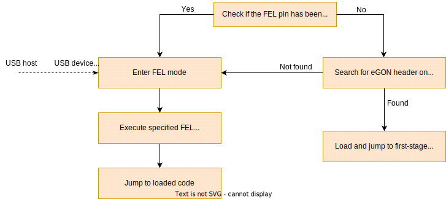

# MangoPi MQ-Pro
The [MangoPi MQ-Pro](https://mangopi.org/mangopi_mqpro) is a small RISC-V development board, featuring an Allwinner D1 SoC with a single RV64 core, and either 512MiB or 1GiB
of memory. Most public information about the D1 itself can be found on the [Sunxi wiki](https://linux-sunxi.org/D1).

You're probably going to want to solder a GPIO header to the board and get a USB-UART adaptor as well. The `xtask` contains a small serial utility for logging the output from
the board, but you can also use an external program such as `minicom`.
Adding a male-to-female jumper wire to a ground pin is also useful - you can touch it to the `RST` pad on the back of the board to reset it (allowing you to FEL new code onto
it).

### Boot procedure
The D1 can be booted from an SD card or flash, or, usefully for development, using Allwinner's FEL protocol, which allows data to be loaded into memory and code executed using
a small USB stack. This procedure is best visualised with a diagram:

The initial part of this process is done by code loaded from the `BROM` (Boot ROM) - it contains the FEL stack, as well as enough code to load the first-stage bootloader from
either an SD card or SPI flash. Data loaded by the FEL stack, or from the bootable media, is loaded into SRAM. The DRAM has to be brought up, either by the first-stage
bootloader, or by a FEL payload.

### Booting via FEL
To boot with FEL, the MQ-Pro needs to be plugged into the development machine via the USB-C OTG port (not the host port), and then booted into FEL mode. The easiest way to do
this is to just remove the SD card - as long as the flash hasn't been written to, this should boot into FEL. It should then enumerate as a USB device with ID `1f3a:efe8` on
the host.

You then need something that can talk the FEL protocol on the host. We're currently using [`xfel`](https://github.com/xboot/xfel), but this may be replaced/augmented with a
more capable solution in the future. `xfel` should be relatively easy to compile and install on a Linux system, and should install some udev rules that allow it to be used by
normal users. `xfel` should then automatically detect a connected device in FEL mode.

The first step is to initialize the DRAM - `xfel ddr d1` does this by uploading and running a small payload with the correct procedures. After this, further code can be loaded
directly into DRAM - we load OpenSBI and Seed.

Then, we load OpenSBI's `FW_JUMP` firmware at the start of RAM, `0x4000_0000`. This provides the SBI interface, moves from M-mode to S-mode, and then jumps into Seed, which is
loaded after 512KiB after it at `0x4008_0000` (this address is supplied to OpenSBI at build-time). We also bundle a device tree for the platform into OpenSBI, which it uses to
bootstrap the platform, and then supplies it onwards.

TODO: we should investigate customising the driver list to maybe get OpenSBI under 256KiB (it's just over).
